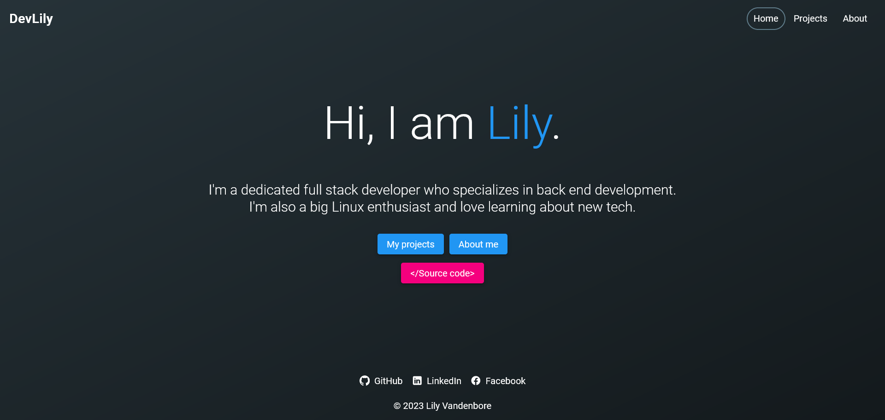

# Portfolio

This is my portfolio website, written in [Angular](https://angular.io/) and designed through the help of [Angular Material](https://material.angular.io/).

A live deployment of this website can be found [here](https://www.lilyvandenbore.com)!

## Hire me

I'm interested in back end or full stack developer positions.

I'm open to both on-site jobs in Belgium and remote jobs internationally.

You can find my resume [here](src/assets/files/resume.pdf).
